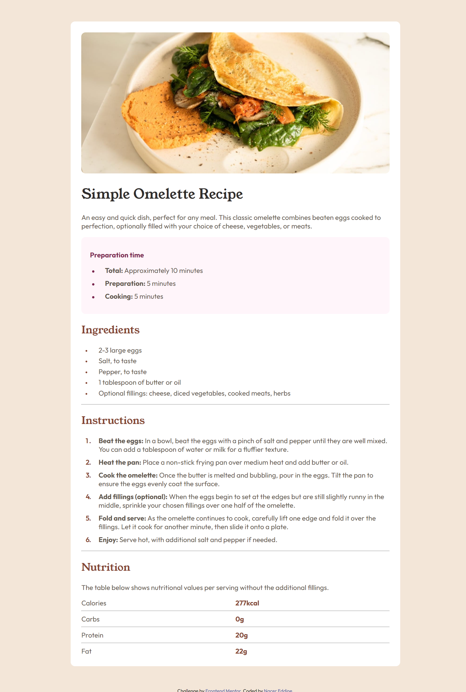

# Frontend Mentor - Recipe page solution

This is a solution to the [Recipe page challenge on Frontend Mentor](https://www.frontendmentor.io/challenges/recipe-page-KiTsR8QQKm). Frontend Mentor challenges help you improve your coding skills by building realistic projects.

## Table of contents

- [Screenshot](#screenshot)
- [Links](#links)
- [Built with](#built-with)
- [What I learned](#what-i-learned)
- [Continued development](#continued-development)
- [Useful resources](#useful-resources)
- [Author](#author)

### Screenshot

### Links

- Solution URL: [Add solution URL here](https://your-solution-url.com)
- Live Site URL: [Add live site URL here](https://your-live-site-url.com)

### Built with

- Semantic HTML5 markup
- CSS custom properties
- Flexbox
- CSS Grid
- Mobile-first workflow

### What I learned

- I learned that the list styles take the color of their text and you can't change that, so I used the before and after pseudo elements to change that
- I learned that _grid_ display can be so useful in aligning items mush more that the _flex_ display (but not in all cases)
  [for example]:
  .flex-table-row {
  display: grid;
  grid-template-columns: repeat(2, 1fr);
  justify-content: space-between;
  }
  this code solved for me the problem of aligning the **.bold.brown** spans at the beggining, which I couldn't figure with _display: flex;_

  - using % values will help you with responsivity better than px values, you should try it.

### Continued development

There for I think I must work more on the _grid_ functionalities

### Useful resources

I didn't use so much external resources in this particular project, bu t I would like to highlight the sources I learned CSS from

- [resource 1](https://elzero.org/) - This helped me learn all the basic concepts and the advanced ones, but it is in arabic
- [Example resource 2](https://www.freecodecamp.org/) - freecodecamp helped me practice and get the certificate for responsive web design

## Author

- Frontend Mentor - [@SimpleMind34](https://www.frontendmentor.io/profile/SimpleMind34)
- Twitter - [@B_Nacer_Eddine](https://x.com/B_Nacer_Eddine)
